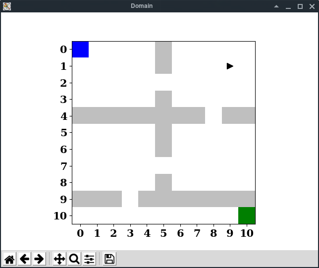

# What's this
This repo contains collections of scripts for [rlpy](https://github.com/rlpy/rlpy)
experiments. Since [my fork of rlpy](https://github.com/kngwyu/rlpy) is now only
available for Linux and Python >= 3.5, these scripts also doesn't support other systems.

## Setup
Install [pipenv](https://pipenv.readthedocs.io/en/latest/) and then
```bash
pipenv --site-packages --three install
```

## Example usages

```bash
pipenv run python gridworld.py --max-steps=100000 --agent=ifddk-q train --visualize-performance=1
```

## Screenshots


## License
This project is licensed under Apache License, Version 2.0
([LICENSE-APACHE](LICENSE) or http://www.apache.org/licenses/LICENSE-2.0).
